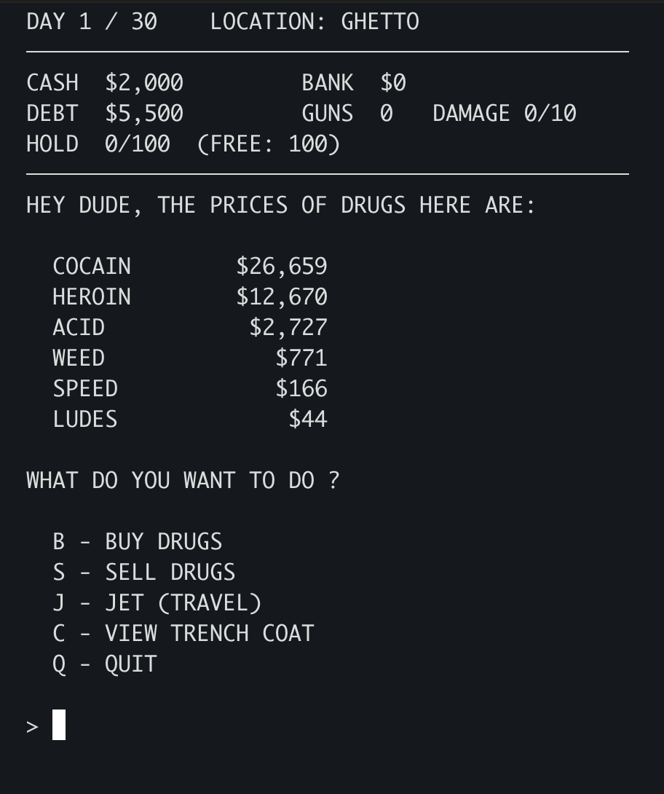

# Drug Wars

A Rust implementation of the classic 1984 trading game Drug Wars.

Buy low, sell high, avoid the police, repay the loan shark, and try to build a fortune in 30 days.



## Prerequisites 

Install [rust](https://rust-lang.org/tools/install/)

## Running


``` bash 
cargo run --release

  ╔═══════════════════════════════════════════════╗
  ║                                               ║
  ║            D R U G   W A R S                  ║
  ║                                               ║
  ║      A GAME BASED ON THE NEW YORK             ║
  ║               DRUG MARKET                     ║
  ║                                               ║
  ║           BY JOHN E. DELL                     ║
  ║            COPYRIGHT (1984)                   ║
  ║                                               ║
  ╚═══════════════════════════════════════════════╝


  DO YOU WANT INSTRUCTIONS ? (Y/N):
```

## Gameplay

You begin with:

* $2,000 cash
* A debt to the loan shark
* An empty trench coat

Each trip between locations advances the game by one day. Prices change constantly, creating opportunities for profit. The game ends after 30 days.

The objective is simple:

* Pay off the loan shark.
* Make as much money as possible before time runs out.

## References

1. [Wikipedia Drug Wars](https://en.wikipedia.org/wiki/Drug_Wars_(video_game))
2. [TI-Basic Calculator](https://gist.github.com/mattmanning/1002653)
3. [Binary](https://www.dosgamesarchive.com/download/drugwars)

## Acknowledgements

Drug Wars was originally created by John E. Dell in 1984 as a DOS game and later inspired numerous ports and adaptations on calculators, BBS systems, desktop computers, and mobile devices.

